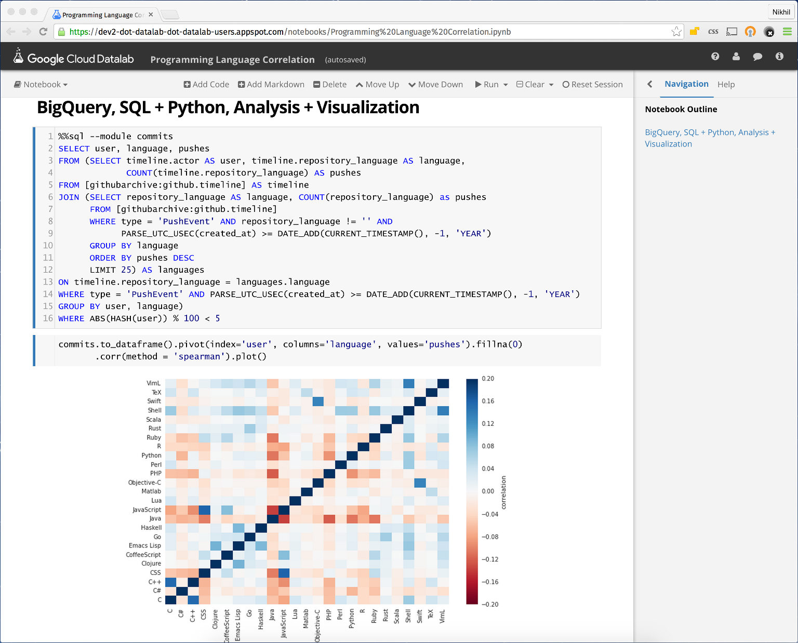

# Google Cloud DataLab

[Google Cloud DataLab](https://cloud.google.com/datalab) provides a productive, interactive, and
integrated tool to explore, visualize, analyze and transform data, bringing together the power of
Python, SQL, and the [Google Cloud Platform](https://cloud.google.com) with services such as
[BigQuery](https://cloud.google.com/bigquery) and [Storage](https://cloud.google.com/storage).

DataLab builds on the interactive notebooks, and the foundation of [Jupyter](http://jupyter.org)
(formerly IPython) to enable developers, data scientists and data analysts to easily work with
their data from exploration to developing and deploying data pipelines, all within notebooks.

DataLab deeply integrates into Google Cloud Platform to allow users to extract insights and harness
the full value of their data. It provides a secure environment for members of a cloud project
to effortlessly access data and resources accessible from the project, and to share notebooks via
git.

You can see an example of the notebooks by browsing through the
[samples and documentation](https://github.com/GoogleCloudPlatform/datalab/tree/master/content/datalab),
which are themselves written in the form of notebooks.

## Using DataLab and Getting Started

DataLab is packaged as a docker container which contains Jupyter/IPython, and a variety of python
libraries such as numpy, pandas, scikit-learn and matplotlib, in a ready-to-use form.

The simplest way to start using DataLab is on Google Cloud Platform. Head over to the
[Google Cloud DataLab deployer](https://datalab.cloud.google.com) and deploy your own instance.

You can also run the docker container locally, as described in the
[wiki](https://github.com/googlecloudplatform/datalab/wiki/Getting-Started).

### Contacting Us

For support or help using DataLab, please submit questions tagged with `google-cloud-datalab` on [StackOverflow](http://stackoverflow.com/questions/tagged/google-cloud-datalab).

For any product issues, you can either [submit issues](https://github.com/GoogleCloudPlatform/datalab/issues)
here on this project page, or you can submit your feedback using the feedback link available
within the product.

## Developing DataLab

### Building and Running

The [wiki](https://github.com/googlecloudplatform/datalab/wiki/Development-Environment) describes
the process of setting up a local development environment, as well as the steps to build and run,
and the developer workflow.

### Contributing

Contributions are welcome! Please see our [roadmap](https://github.com/GoogleCloudPlatform/datalab/wiki/Roadmap)
page. Please check the page on [contributing](https://github.com/GoogleCloudPlatform/datalab/wiki/Contributing)
for more details.

You can always contribute even without code submissions by submitting issues and suggestions to
help improve DataLab and building and sharing samples and being a member of the community.

### Repository Overview

This is a quick description of the repository structure to help understand and
discover the relevant pieces.

All source code corresponding to product functionality that is built exists
within `/sources`. The following is a list of the individual components:

* `/sources/lib` - set of python libraries used to implement APIs to access Google
  Cloud Platform services, and implement the DataLab interactive experience.
  - api: Google Cloud Platform APIs (currently: BigQuery and Cloud Storage).
  - datalab: interactive notebook experience to plug into Jupyter and IPython.

* `/sources/web` - the DataLab web server. This is implemented in node.js and
  serves the DataLab front-end experience - both content and APIs, as well as backend
  infrastructure such as notebook source control.
  Some of the requests are proxied to the Jupyter notebook server, which manages notebooks and
  associated kernel sessions.

* `/sources/tools` - miscellaneous other supporting tools.

Source code builds into the /build directory, and the generated build outputs are
consumed when building the DataLab docker container.

The build outputs are packaged in the form of a docker container.

* `/containers/datalab` - the only container for now. This is the container that is used as the
  DataLab AppEngine module.

